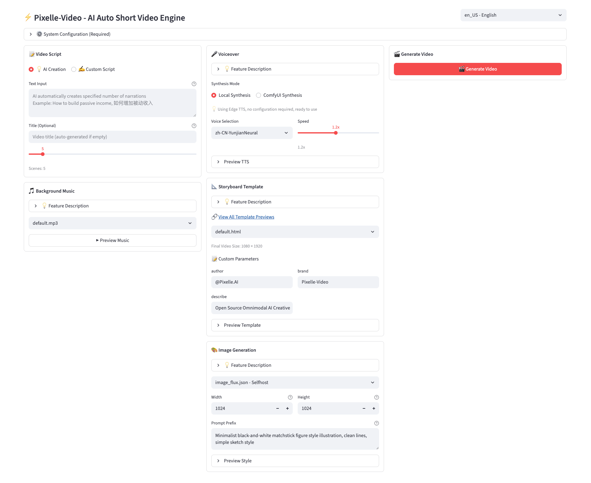
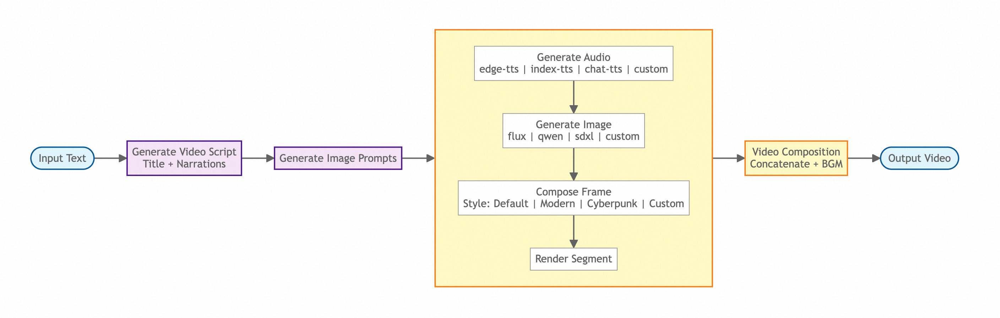

<h1 align="center">🎬 Pixelle-Video —— Công Cụ Tạo Video Ngắn Tự Động Hoàn Toàn Bằng AI</h1>

<p align="center"><a href="README_EN.md">English</a> | <a href="README.md">中文</a> | <b>Tiếng Việt</b></p>

<p align="center">
  <a href="https://www.youtube.com/watch?v=uUkx-lRxLjc" target="_blank"></a>
  <a href="https://github.com/AIDC-AI/Pixelle-Video/releases" target="_blank"></a>
  <a href="https://aidc-ai.github.io/Pixelle-Video" target="_blank"></a>
  <a href="https://github.com/AIDC-AI/Pixelle-Video/stargazers"></a>
  <a href="https://github.com/AIDC-AI/Pixelle-Video/issues"></a>
  <a href="https://github.com/AIDC-AI/Pixelle-Video/network/members"></a>
  <a href="https://github.com/AIDC-AI/Pixelle-Video/blob/main/LICENSE"></a>
</p>

https://github.com/user-attachments/assets/a42e7457-fcc8-40da-83fc-784c45a8b95d

Chỉ cần nhập một **chủ đề**, Pixelle-Video sẽ tự động:
- ✍️ Viết kịch bản video
- 🎨 Tạo hình ảnh / video bằng AI
- 🗣️ Tổng hợp giọng đọc thuyết minh
- 🎵 Thêm nhạc nền
- 🎬 Tạo video chỉ với một cú nhấp

**Không ngưỡng kỹ thuật, không cần kinh nghiệm dựng phim** — Làm cho việc tạo video đơn giản như gõ một câu!


## 🖥️ Giao Diện Web




## 📋 Cập Nhật Gần Đây

- ✅ **26-01-2026**: Thêm pipeline Chuyển Động (Motion Transfer) — tải lên video tham chiếu và hình ảnh để truyền chuyển động.
- ✅ **14-01-2026**: Thêm pipeline "Nhân Vật Số" và "Ảnh sang Video", hỗ trợ giọng nói TTS đa ngôn ngữ.
- ✅ **06-01-2026**: Hỗ trợ máy RunningHub 48G VRAM.
- ✅ **28-12-2025**: Giới hạn xử lý đồng thời RunningHub có thể cấu hình, cải thiện xử lý phản hồi dữ liệu có cấu trúc LLM.
- ✅ **17-12-2025**: Thêm cấu hình API Key ComfyUI, hỗ trợ mô hình Nano Banana, tham số tùy chỉnh template API.
- ✅ **10-12-2025**: Tích hợp FAQ trong thanh bên, cố định phiên bản edge-tts để giải quyết sự cố dịch vụ TTS.
- ✅ **08-12-2025**: Hỗ trợ nhiều chế độ tách kịch bản (đoạn/dòng/câu), cải thiện lựa chọn template với xem trước trực tiếp.
- ✅ **06-12-2025**: Sửa lỗi xử lý đường dẫn URL API tạo video với khả năng tương thích đa nền tảng.
- ✅ **05-12-2025**: Thêm gói Windows all-in-one, tối ưu quy trình phân tích hình ảnh và video.
- ✅ **04-12-2025**: Tính năng "Phương Tiện Tùy Chỉnh" mới — tải lên ảnh/video của bạn với phân tích AI và tạo kịch bản.
- ✅ **18-11-2025**: Xử lý song song cho RunningHub, thêm trang lịch sử, hỗ trợ tạo nhiều tác vụ video hàng loạt.


## ✨ Tính Năng Nổi Bật

- ✅ **Tạo Hoàn Toàn Tự Động** — Nhập chủ đề, tự động tạo video hoàn chỉnh.
- ✅ **Viết Kịch Bản Thông Minh** — AI tự động tạo lời thuyết minh theo chủ đề, không cần tự viết kịch bản.
- ✅ **Tạo Hình Ảnh AI** — Mỗi câu đi kèm minh họa AI đẹp mắt.
- ✅ **Tạo Video AI** — Hỗ trợ mô hình tạo video AI (như WAN 2.1) để tạo nội dung video động.
- ✅ **Tạo Giọng Đọc AI** — Hỗ trợ Edge-TTS, Index-TTS và nhiều giải pháp TTS phổ biến khác.
- ✅ **Nhạc Nền** — Hỗ trợ thêm nhạc nền để video thêm sinh động.
- ✅ **Phong Cách Hình Ảnh** — Nhiều template để lựa chọn, tạo phong cách video độc đáo.
- ✅ **Kích Thước Linh Hoạt** — Hỗ trợ video dọc, ngang và các kích thước khác.
- ✅ **Nhiều Mô Hình AI** — Hỗ trợ GPT, Qwen, DeepSeek, Ollama và nhiều hơn nữa.
- ✅ **Kết Hợp Linh Hoạt** — Dựa trên kiến trúc ComfyUI, có thể sử dụng quy trình có sẵn hoặc tùy chỉnh (ví dụ: thay mô hình tạo hình ảnh bằng FLUX, thay TTS bằng ChatTTS, v.v.).


## 📊 Quy Trình Tạo Video

Pixelle-Video áp dụng thiết kế mô-đun, toàn bộ quy trình tạo video rõ ràng và súc tích:



Từ văn bản đầu vào đến video đầu ra cuối cùng, toàn bộ quy trình đơn giản và rõ ràng: **Tạo Kịch Bản → Lập Kế Hoạch Hình Ảnh → Xử Lý Từng Khung → Ghép Video**

Mỗi bước đều hỗ trợ tùy chỉnh linh hoạt, cho phép bạn chọn các mô hình AI, công cụ âm thanh, phong cách hình ảnh khác nhau để đáp ứng nhu cầu sáng tạo cá nhân.


## 🎬 Video Mẫu

Dưới đây là các video thực tế được tạo bằng Pixelle-Video, thể hiện hiệu ứng với các chủ đề và phong cách khác nhau:

### 📱 Video Từ Module Mở Rộng

<table>
<tr>
<td width="33%">
<h3>👤 Nhân Vật Số AI</h3>
<video src="https://github.com/user-attachments/assets/7c122563-c2e0-4dcd-a73c-25ba1d4fa2dd" controls width="100%"></video>
<p align="center"><b>Nhân Vật AI Nói Tiếng Hàn</b></p>
</td>
<td width="33%">
<h3>🖼️ Ảnh Sang Video</h3>
<video src="https://github.com/user-attachments/assets/5b4eef17-07d0-4bde-9748-2ed68cc9888e" controls width="100%"></video>
<p align="center"><b>Video Hoạt Hình</b></p>
</td>
<td width="33%">
<h3>💃 Chuyển Động</h3>
<video src="https://github.com/user-attachments/assets/7b1240bc-e965-434c-b343-118ec4793d4f" controls width="100%"></video>
<p align="center"><b>Mèo Nhảy Múa</b></p>
</td>
</tr>
</table>

### 📱 Video Dọc

<table>
<tr>
<td width="33%">
<h3>🌄 Phong Cách Tài Liệu & Lối Sống – Template Mặc Định</h3>
<video src="https://github.com/user-attachments/assets/e6716c1d-78de-453d-84c2-10873c8c595f" controls width="100%"></video>
<p align="center"><b>Cảnh Đẹp Trên Hành Trình</b></p>
</td>
<td width="33%">
<h3>🔍 Giải Mã Văn Hóa – Template Mặc Định</h3>
<video src="https://github.com/user-attachments/assets/f5de75f6-135a-4ab4-9f5f-079f649764d5" controls width="100%"></video>
<p align="center"><b>Hồ Sơ Ông Già Noel</b></p>
</td>
<td width="33%">
<h3>🔭 Khám Phá Khoa Học – Template Mặc Định</h3>
<video src="https://github.com/user-attachments/assets/ceb8b0df-8331-4e1f-88e7-db5b295a1c1d" controls width="100%"></video>
<p align="center"><b>Tại Sao Chưa Tìm Thấy Nền Văn Minh Ngoài Hành Tinh?</b></p>
</td>
</tr>
<tr>
<td width="33%">
<h3>🌱 Phát Triển Bản Thân – Nhân Bản Giọng Nói</h3>
<video src="https://github.com/user-attachments/assets/1bad9a49-df83-4905-9cc8-9a7640e9c7d8" controls width="100%"></video>
<p align="center"><b>Làm Thế Nào Để Nâng Cấp Bản Thân</b></p>
</td>
<td width="33%">
<h3>🧠 Tư Duy Sâu Sắc – Template Mặc Định</h3>
<video src="https://github.com/user-attachments/assets/663b705a-2aea-44bc-b266-4bb27aa255a8" controls width="100%"></video>
<p align="center"><b>Hiểu Về Chống Dễ Vỡ</b></p>
</td>
<td width="33%">
<h3>🏯 Lịch Sử & Văn Hóa – Khung Tĩnh</h3>
<video src="https://github.com/user-attachments/assets/56e0a018-fa99-47eb-a97f-fc2fa8915724" controls width="100%"></video>
<p align="center"><b>Tư Trị Thông Giám</b></p>
</td>
</tr>
<tr>
<td width="33%">
<h3>☀️ Kể Chuyện Cảm Xúc – Nhân Bản Giọng Nói</h3>
<video src="https://github.com/user-attachments/assets/4687df95-dd21-4a7b-b01e-f33a7b646644" controls width="100%"></video>
<p align="center"><b>Ánh Nắng Mùa Đông</b></p>
</td>
<td width="33%">
<h3>📜 Chuyển Thể Tiểu Thuyết – Kịch Bản Tùy Chỉnh</h3>
<video src="https://github.com/user-attachments/assets/d354465e-3fa8-40b4-93e9-61ad75ef0697" controls width="100%"></video>
<p align="center"><b>Đấu Phá Thương Khung</b></p>
</td>
<td width="33%">
<h3>🧬 Giải Thích Kiến Thức – Qwen Tạo Hình Ảnh</h3>
<video src="https://github.com/user-attachments/assets/8ac21768-41ce-4d41-acdd-e3dd3eb9725a" controls width="100%"></video>
<p align="center"><b>Bí Quyết Chăm Sóc Sức Khỏe</b></p>
</td>
</tr>
</table>

### 🖥️ Video Ngang

<table>
<tr>
<td width="50%">
<h3>💰 Kiếm Thêm Thu Nhập - Template Phim</h3>
<video src="https://github.com/user-attachments/assets/c9209d4e-73a6-4b82-aaad-cf102248c9e2" controls width="100%"></video>
<p align="center"><b>Kiếm Thêm Thu Nhập</b></p>
</td>
<td width="50%">
<h3>🏛️ Bình Luận Lịch Sử - Template Tùy Chỉnh</h3>
<video src="https://github.com/user-attachments/assets/a767c452-d5f1-4cff-bb34-b80fff0d4c3e" controls width="100%"></video>
<p align="center"><b>Bài Học Từ Tư Trị Thông Giám</b></p>
</td>
</tr>
</table>

> 💡 **Mẹo**: Tất cả các video này đều được AI tạo ra hoàn toàn tự động chỉ bằng cách nhập từ khóa chủ đề, không cần bất kỳ kinh nghiệm dựng phim nào!

<div id="tutorial-start" />

## 🚀 Bắt Đầu Nhanh

### 🪟 Gói All-in-One cho Windows (Khuyến Nghị cho Người Dùng Windows)

**Không cần cài Python, uv hay ffmpeg — Sẵn sàng sử dụng ngay lập tức!**

👉 **[Tải Gói All-in-One cho Windows](https://github.com/AIDC-AI/Pixelle-Video/releases/latest)**

1. Tải gói All-in-One Windows mới nhất và giải nén
2. Nhấp đúp vào `start.bat` để khởi chạy giao diện Web
3. Trình duyệt sẽ tự động mở http://localhost:8501
4. Cấu hình LLM API và dịch vụ tạo hình ảnh trong "⚙️ Cấu Hình Hệ Thống"
5. Bắt đầu tạo video!

> 💡 **Mẹo**: Gói đã bao gồm tất cả các phụ thuộc, không cần cài đặt thủ công bất kỳ môi trường nào. Lần đầu sử dụng, bạn chỉ cần cấu hình API key.


### Cài Từ Mã Nguồn (Dành cho macOS / Linux hoặc Người Dùng Cần Tùy Chỉnh)

#### Yêu Cầu

Trước khi bắt đầu, bạn cần cài đặt trình quản lý gói Python `uv` và công cụ xử lý video `ffmpeg`:

##### Cài đặt uv

Vui lòng truy cập tài liệu chính thức của uv để xem phương pháp cài đặt cho hệ thống của bạn:  
👉 **[Hướng Dẫn Cài Đặt uv](https://docs.astral.sh/uv/getting-started/installation/)**

Sau khi cài đặt, chạy `uv --version` trong terminal để xác nhận cài đặt thành công.

##### Cài đặt ffmpeg

**macOS**
```bash
brew install ffmpeg
```

**Ubuntu / Debian**
```bash
sudo apt update
sudo apt install ffmpeg
```

**Windows**
- URL tải xuống: https://ffmpeg.org/download.html
- Sau khi tải về, giải nén và thêm thư mục `bin` vào biến môi trường PATH

Sau khi cài đặt, chạy `ffmpeg -version` trong terminal để xác nhận cài đặt thành công.


#### Bước 1: Sao Chép Dự Án

```bash
git clone https://github.com/AIDC-AI/Pixelle-Video.git
cd Pixelle-Video
```

#### Bước 2: Khởi Chạy Giao Diện Web

```bash
# Chạy với uv (khuyến nghị, sẽ tự động cài đặt các phụ thuộc)
uv run streamlit run web/app.py
```

Trình duyệt sẽ tự động mở http://localhost:8501

#### Bước 3: Cấu Hình trên Giao Diện Web

Lần đầu sử dụng, mở rộng bảng "⚙️ Cấu Hình Hệ Thống" và điền:
- **Cấu hình LLM**: Chọn mô hình AI (như Qwen, GPT, v.v.) và nhập API Key
- **Cấu hình Hình Ảnh**: Nếu cần tạo hình ảnh, cấu hình địa chỉ ComfyUI hoặc RunningHub API Key

Sau khi cấu hình, nhấp "Lưu Cấu Hình" và bạn có thể bắt đầu tạo video!

<div id="tutorial-end" />

## 💻 Cách Sử Dụng

Sau khi mở giao diện Web, bạn sẽ thấy bố cục ba cột. Dưới đây là giải thích chi tiết từng phần:


### ⚙️ Cấu Hình Hệ Thống (Bắt Buộc Khi Dùng Lần Đầu)

Lần đầu sử dụng cần cấu hình. Nhấp để mở rộng bảng "⚙️ Cấu Hình Hệ Thống":

#### 1. Cấu Hình LLM (Mô Hình Ngôn Ngữ Lớn)
Dùng để tạo kịch bản video.

**Chọn Nhanh Preset**
- Chọn mô hình preset từ menu thả xuống (Qwen, GPT-4o, DeepSeek, v.v.)
- Sau khi chọn, base_url và model sẽ được điền tự động
- Nhấp liên kết "🔑 Lấy API Key" để đăng ký và lấy key

**Cấu Hình Thủ Công**
- API Key: Nhập key của bạn
- Base URL: Địa chỉ API
- Model: Tên mô hình

#### 2. Cấu Hình Hình Ảnh
Dùng để tạo hình ảnh cho video.

**Triển Khai Cục Bộ (Khuyến Nghị)**
- ComfyUI URL: Địa chỉ dịch vụ ComfyUI cục bộ (mặc định http://127.0.0.1:8188)
- Nhấp "Kiểm Tra Kết Nối" để xác nhận dịch vụ hoạt động

**Triển Khai Đám Mây**
- RunningHub API Key: Key dịch vụ tạo hình ảnh đám mây

Sau khi cấu hình, nhấp "Lưu Cấu Hình".


### 📝 Nhập Nội Dung (Cột Trái)

#### Chế Độ Tạo
- **Nội Dung Tạo Bởi AI**: Nhập chủ đề, AI tự động tạo kịch bản
  - Phù hợp với: Muốn tạo video nhanh, để AI viết kịch bản
  - Ví dụ: "Tại sao nên phát triển thói quen đọc sách"
- **Nội Dung Kịch Bản Cố Định**: Nhập trực tiếp kịch bản hoàn chỉnh, bỏ qua bước AI tạo kịch bản
  - Phù hợp với: Đã có sẵn kịch bản, tạo video trực tiếp

#### Nhạc Nền (BGM)
- **Không BGM**: Chỉ giọng đọc thuần túy
- **Nhạc Có Sẵn**: Chọn nhạc nền preset (như default.mp3)
- **Nhạc Tùy Chỉnh**: Đặt file nhạc của bạn (MP3/WAV, v.v.) vào thư mục `bgm/`
- Nhấp "Xem Trước BGM" để nghe thử nhạc


### 🎤 Cài Đặt Giọng Đọc (Cột Giữa)

#### Quy Trình TTS
- Chọn quy trình TTS từ menu thả xuống (hỗ trợ Edge-TTS, Index-TTS, v.v.)
- Hệ thống sẽ tự động quét các quy trình TTS trong thư mục `workflows/`
- Nếu bạn biết ComfyUI, bạn có thể tùy chỉnh quy trình TTS

#### Audio Tham Chiếu (Tùy Chọn)
- Tải lên file audio tham chiếu để nhân bản giọng nói (hỗ trợ MP3/WAV/FLAC và các định dạng khác)
- Phù hợp cho các quy trình TTS hỗ trợ nhân bản giọng nói (như Index-TTS)
- Có thể nghe trực tiếp sau khi tải lên

#### Tính Năng Xem Trước
- Nhập văn bản thử nghiệm, nhấp "Xem Trước Giọng Đọc" để nghe hiệu ứng
- Hỗ trợ sử dụng audio tham chiếu để xem trước


### 🎨 Cài Đặt Hình Ảnh (Cột Giữa)

#### Tạo Hình Ảnh
Xác định phong cách hình ảnh AI tạo ra.

**Quy Trình ComfyUI**
- Chọn quy trình tạo hình ảnh từ menu thả xuống
- Hỗ trợ quy trình triển khai cục bộ (selfhost) và đám mây (RunningHub)
- Mặc định sử dụng `image_flux.json`
- Nếu bạn biết ComfyUI, có thể đặt quy trình của bạn vào thư mục `workflows/`

**Kích Thước Hình Ảnh**
- Đặt chiều rộng và chiều cao của hình ảnh tạo ra (đơn vị: pixel)
- Mặc định 1024x1024, có thể điều chỉnh theo nhu cầu
- Lưu ý: Các mô hình khác nhau có giới hạn kích thước khác nhau

**Tiền Tố Prompt**
- Kiểm soát phong cách tổng thể của hình ảnh (ngôn ngữ cần là tiếng Anh)
- Ví dụ: Minimalist black-and-white matchstick figure style illustration, clean lines, simple sketch style
- Nhấp "Xem Trước Phong Cách" để kiểm tra hiệu ứng

#### Template Video
Xác định bố cục và thiết kế video.

**Quy Tắc Đặt Tên Template**
- `static_*.html`: Template tĩnh (không có phương tiện AI, chỉ văn bản)
- `image_*.html`: Template hình ảnh (sử dụng hình ảnh AI làm nền)
- `video_*.html`: Template video (sử dụng video AI làm nền)

**Cách Dùng**
- Chọn template từ menu thả xuống, hiển thị theo nhóm kích thước (dọc/ngang/vuông)
- Nhấp "Xem Trước Template" để kiểm tra hiệu ứng với các tham số tùy chỉnh
- Nếu bạn biết HTML, có thể tạo template riêng trong thư mục `templates/`
- 🔗 [Xem Tất Cả Bản Xem Trước Template](https://aidc-ai.github.io/Pixelle-Video/user-guide/templates/#built-in-template-preview)


### 🎬 Tạo Video (Cột Phải)

#### Nút Tạo
- Sau khi cấu hình tất cả tham số, nhấp "🎬 Tạo Video"
- Hiển thị tiến độ thời gian thực (tạo kịch bản → tạo hình ảnh → tổng hợp giọng nói → ghép video)
- Tự động hiển thị xem trước video sau khi hoàn thành

#### Hiển Thị Tiến Độ
- Hiển thị bước hiện tại theo thời gian thực
- Ví dụ: "Khung 3/5 - Đang Tạo Hình Ảnh"

#### Xem Trước Video
- Tự động phát sau khi tạo xong
- Hiển thị thời lượng video, kích thước file, số lượng khung, v.v.
- File video được lưu trong thư mục `output/`


### ❓ Câu Hỏi Thường Gặp

**H: Lần đầu sử dụng mất bao lâu?**  
Đ: Thời gian tạo phụ thuộc vào số lượng khung video, điều kiện mạng và tốc độ suy luận AI, thường hoàn thành trong vài phút.

**H: Nếu tôi không hài lòng với video thì sao?**  
Đ: Bạn có thể thử:
1. Đổi mô hình LLM (các mô hình khác nhau có phong cách kịch bản khác nhau)
2. Điều chỉnh kích thước hình ảnh và tiền tố prompt (thay đổi phong cách hình ảnh)
3. Đổi quy trình TTS hoặc tải lên audio tham chiếu (thay đổi hiệu ứng giọng đọc)
4. Thử các template và kích thước video khác nhau

**H: Chi phí như thế nào?**  
Đ: **Dự án này hoàn toàn hỗ trợ vận hành miễn phí!**

- **Giải Pháp Hoàn Toàn Miễn Phí**: LLM dùng Ollama (cục bộ) + ComfyUI triển khai cục bộ = 0 chi phí
- **Giải Pháp Khuyến Nghị**: LLM dùng Qwen (chi phí cực thấp, hiệu quả cao) + ComfyUI triển khai cục bộ
- **Giải Pháp Đám Mây**: LLM dùng OpenAI + Hình ảnh dùng RunningHub (chi phí cao hơn nhưng không cần môi trường cục bộ)

**Gợi Ý Lựa Chọn**: Nếu bạn có GPU cục bộ, khuyến nghị giải pháp hoàn toàn miễn phí, ngược lại khuyến nghị dùng Qwen (hiệu quả chi phí tốt)


## 🤝 Dự Án Tham Chiếu

Thiết kế Pixelle-Video được lấy cảm hứng từ các dự án mã nguồn mở xuất sắc sau:

- [Pixelle-MCP](https://github.com/AIDC-AI/Pixelle-MCP) — Server MCP ComfyUI, cho phép trợ lý AI gọi trực tiếp ComfyUI
- [MoneyPrinterTurbo](https://github.com/harry0703/MoneyPrinterTurbo) — Công cụ tạo video xuất sắc
- [NarratoAI](https://github.com/linyqh/NarratoAI) — Công cụ tự động bình luận phim
- [MoneyPrinterPlus](https://github.com/ddean2009/MoneyPrinterPlus) — Nền tảng tạo video
- [ComfyKit](https://github.com/puke3615/ComfyKit) — Thư viện bọc quy trình ComfyUI

Cảm ơn tinh thần mã nguồn mở của các dự án này! 🙏


## 💬 Cộng Đồng

Quét mã QR bên dưới để tham gia cộng đồng của chúng tôi và nhận cập nhật mới nhất cũng như hỗ trợ kỹ thuật:

| Cộng Đồng Discord | Nhóm WeChat |
| ---- | ---- |
|  |  |


## 📢 Phản Hồi và Hỗ Trợ

- 🐛 **Gặp Vấn Đề**: Gửi [Issue](https://github.com/AIDC-AI/Pixelle-Video/issues)
- 💡 **Đề Xuất Tính Năng**: Gửi [Feature Request](https://github.com/AIDC-AI/Pixelle-Video/issues)
- ⭐ **Đánh Dấu Sao**: Nếu dự án này hữu ích với bạn, hãy cho một Star để ủng hộ!


## 📝 Giấy Phép

Dự án này được phát hành theo Giấy phép Apache 2.0. Để biết chi tiết, vui lòng xem file [LICENSE](LICENSE).


## ⭐ Lịch Sử Star

[](https://star-history.com/#AIDC-AI/Pixelle-Video&Date)
